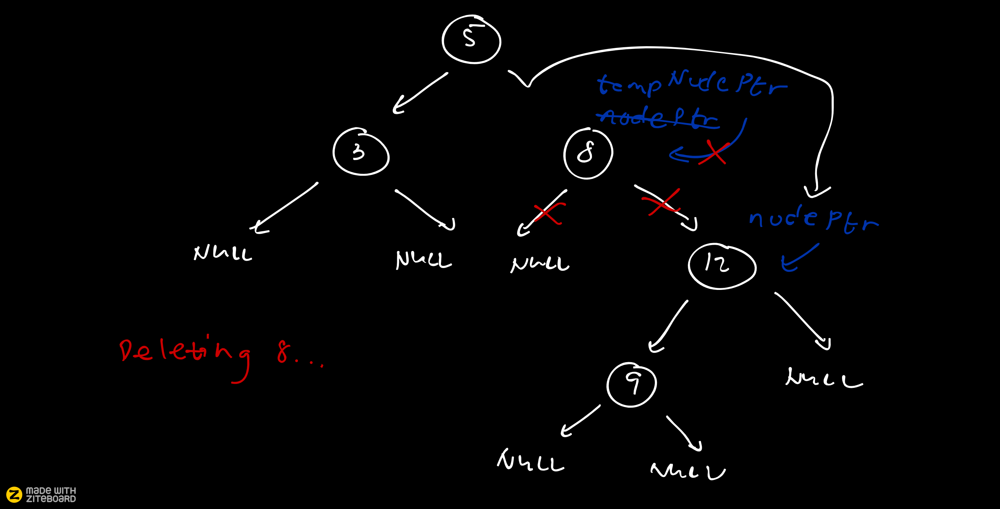

# Binary-Search-Tree-User-Implementation
## Inserting Nodes

## Traversing the Binary Tree
### Inorder Traversal

### Preorder Traversal

### Postorder Traversal

## Searching an Element

## Deleting an Element (Node has one child)
### Deleting '8'

### Delete'12'

### Deletion of a Node with Two Children '8'

